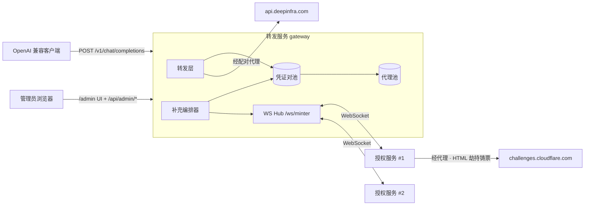

# 转发服务 / 授权服务 拆分架构设计

日期：2026-08-26
状态：设计确认，待实现
取代：`old/` 单体项目（`nlt2api` v3.17.1）

## 1. 背景与拆分动机

`old/` 是一个单体 Nitro 应用：它既要跑 OpenAI 兼容转发，又要在同进程内 spawn Chromium 铸造 Cloudflare Turnstile ticket。这带来三个结构问题：

1. **镜像与内存耦合**：转发逻辑本身只需要 ~100 MB 的 Node 进程，却被迫和 Chromium + Xvfb + 字体（镜像 >800 MB，运行时 ~1.6 GB/浏览器实例）打包在一起。
2. **无法横向扩容铸票**：`DEEPINFRA_TURNSTILE_MINTERS` 只能在单机内加实例，受单机内存与单个出口 IP 限制。
3. **ticket 现取现用的时序耦合**：`deepInfraChat` 每次请求同步 `mint()`，铸票耗时（冷启动 ~31s，热态 ~10s）直接压在客户端请求延迟上。

`docs/designs/2026-08-26-self-rendered-turnstile-design.md`（见 `old/docs/`）已实测验证：**劫持 `deepinfra.com` 首个 HTML 文档响应、在自渲染页面里用同一 site key 调 `turnstile.render()`，产出的 token 可被上游直接接受**。每次铸票的页面载荷从整个 SPA 降为几行 HTML，铸票不再依赖 DeepInfra 的聊天控件 DOM。这让铸票变成一个足够独立、足够轻的职责，可以搬到独立进程/独立机器。

因此拆成两个项目：

| 项目 | 目录 | 职责 | 运行环境 |
| --- | --- | --- | --- |
| 转发服务 | `gateway/` | 代理池、凭证对池、任务编排、OpenAI 兼容转发、管理后台 | `node:22-slim`，无浏览器 |
| 授权服务 | `minter/` | 连 gateway 的 WS、领取空闲代理、经代理用 HTML 劫持铸票、回传 | 需 Chromium + Xvfb，无 HTTP 服务、无后台 |

## 2. 与旧项目的关键差异

### 2.1 ticket 从「现取现用」改为「预铸池化」

旧实测结论：未使用的 token 自然有效窗口约 3~4 分钟（178s 仍 200，245s 已 403）。旧设计据此得出「不要预铸缓存」。

新设计仍然遵守这条物理约束，但把它变成**池的驱逐策略**而非「禁止池化」：

- 池里每张凭证带 `expiresAt = mintedAt + ticketTtlSeconds`，默认 `ticketTtlSeconds = 170`（实测安全上界 178s 再留 8s 余量）。
- **取用时按 `expiresAt` 升序**（用户要求的「接近过期时间的 token 优先使用」）：先烧快过期的，让年轻凭证留给后续请求，池的整体命中率最高、浪费最少。
- 取用时要求 `expiresAt - now >= ticketMinRemainingSeconds`（默认 20s），保证凭证在上游握手+首字节前不会过期。
- 后台清理器周期性删除已过期凭证。

这把铸票延迟从客户端请求路径上摘掉，代价是需要维护「最低可用凭证数」水位。

### 2.2 ticket 与代理 IP 强制成对

旧代码注释断言 ticket 不绑定铸票 IP，因此共享一个 minter 服务所有出口。新设计**不依赖这个假设**：凭证在池中与铸造它的代理绑定成 `(proxy, ticket)` 对，转发时凭证与出口必须同源。

理由：
- 上游随时可能收紧为「ticket 绑定铸票 IP」，成对存储时这个变化零成本；反之则要重写池。
- 成对后每条凭证的失败可以精确归因到某个代理，代理健康度信号更干净。
- 用户明确要求「代理ip和token组成一对」。

代价：授权服务必须**经代理启动浏览器**，见 §5.3。

### 2.3 首版转发范围收敛

旧项目在转发层堆了约 6000 行增强逻辑（工具调用注入 `tool-calls.ts` 914 行 + `xml-tool-calls.ts` 1156 行、Responses API 1272 行、`chat-service.ts` 1824 行、用量分析 1282 行、账号分组、容量预测）。这些**不进首版**。

首版转发层只做透明转发：

- `GET /v1/models`、`GET /v1/models/:id`
- `POST /v1/chat/completions`（流式 SSE 与非流式，请求体原样透传上游）
- `GET /health`

明确不做（保留在 `old/` 供后续按需迁移）：Responses API、工具调用格式注入与 XML 解析、账号/账号组/组 API key、用量分析与容量预测、调试记录浏览器、免费代理源自动同步。

## 3. 系统拓扑



数据流：

1. 编排器发现可用凭证低于水位 → 通过 WS 向在线授权服务下发 `mint.request{count}`。
2. 授权服务按自己的并发余量，逐个发 `proxy.lease` 领取一个**活跃且空闲**的代理。
3. 授权服务用 `--proxy-server` 启动/复用浏览器，劫持 HTML 自渲染 Turnstile，拿到 token。
4. 授权服务 `ticket.submit` 回传 `{leaseId, token, source, userAgent, mintedAt}`；gateway 落库成 `(proxy, ticket)` 对并释放 lease。
5. 客户端请求到达 → 转发层原子取出一张最接近过期的可用凭证 → 用其配对代理发上游请求 → 凭证标记消费。

## 4. 转发服务（gateway）设计

### 4.1 技术选型

沿用旧栈以最大化复用：Nitro v3 + Vite + Vue 3 + `reka-ui` + 手写 CSS（无 Tailwind）、`undici`（HTTP 代理 dispatcher）、`socks`（SOCKS 连接器）、`node:sqlite` 内置驱动、`node:test` 测试。WS 服务端用 Nitro 的 `defineWebSocketHandler`（底层 crossws），需在 `nitro.config.ts` 打开 `features.websocket`。

可直接从 `old/` 迁移的模块（按原样或小幅裁剪）：

| 旧文件 | 用途 | 处理方式 |
| --- | --- | --- |
| `server/utils/proxy.ts` | 代理 URL 解析/规范化/掩码/dispatcher | 迁移，去掉 `egressIdentity` 的账号唯一性用途 |
| `server/utils/http.ts` | `HttpError`、`jsonResponse`、`openAIErrorResponse`、鉴权 | 迁移并简化（去掉组 API key 分支） |
| `server/utils/upstream-http.ts` | 带超时/字节上限的 `upstreamFetch` | 迁移 |
| `server/utils/upstream-stream.ts` | SSE 透传 | 迁移 |
| `server/utils/upstream-retry.ts` | 重试判定 | 迁移 |
| `server/utils/analytics-database.ts` | `node:sqlite` 迁移框架写法 | 参考写法，表结构全新 |
| `app/assets/*.css`、`app/components/ui/*` | 主题与 UI 原语 | 迁移 |

### 4.2 SQLite 持久化

单库 `${DATA_DIR}/gateway.db`，`node:sqlite` 的 `DatabaseSync`，`journal_mode=WAL`、`busy_timeout=5000`、`foreign_keys=ON`。用 `schema_migrations(version)` 递增迁移。

```sql
-- 代理池
CREATE TABLE proxies (
  id             TEXT PRIMARY KEY,
  url            TEXT NOT NULL UNIQUE,   -- 规范化后的完整 URL（含凭证）
  kind           TEXT NOT NULL,          -- http | socks4 | socks5
  status         TEXT NOT NULL,          -- active | pending | unavailable
  label          TEXT,
  created_at     INTEGER NOT NULL,
  updated_at     INTEGER NOT NULL,
  checked_at     INTEGER,
  healthy_at     INTEGER,
  latency_ms     INTEGER,
  failure_count  INTEGER NOT NULL DEFAULT 0,
  last_error     TEXT,
  retry_after    INTEGER,                -- 冷却截止（epoch ms）
  leased_by      TEXT,                   -- 持有 lease 的授权服务会话 id
  lease_id       TEXT,
  lease_expires  INTEGER
);
CREATE INDEX proxies_status ON proxies (status, retry_after);

-- 凭证对池：一行即一个 (代理, token) 对
CREATE TABLE tickets (
  id          TEXT PRIMARY KEY,
  proxy_id    TEXT NOT NULL REFERENCES proxies(id) ON DELETE CASCADE,
  token       TEXT NOT NULL,
  source      TEXT NOT NULL,             -- X-Deepinfra-Source
  user_agent  TEXT,
  minted_at   INTEGER NOT NULL,
  expires_at  INTEGER NOT NULL,
  claimed_at  INTEGER,                   -- 已被某个转发请求取走
  minter_id   TEXT                       -- 铸造它的授权服务 agent_id（审计）
);
CREATE INDEX tickets_available ON tickets (claimed_at, expires_at);
CREATE INDEX tickets_proxy ON tickets (proxy_id);

-- 在线/历史授权服务会话
CREATE TABLE minter_sessions (
  id             TEXT PRIMARY KEY,
  agent_id       TEXT NOT NULL,          -- 授权服务自报的稳定标识
  label          TEXT,
  version        TEXT,
  platform       TEXT,
  concurrency    INTEGER NOT NULL DEFAULT 1,
  remote_addr    TEXT,
  connected_at   INTEGER NOT NULL,
  last_seen_at   INTEGER NOT NULL,
  disconnected_at INTEGER,
  minted_count   INTEGER NOT NULL DEFAULT 0,
  failed_count   INTEGER NOT NULL DEFAULT 0,
  last_error     TEXT
);
CREATE INDEX minter_sessions_online ON minter_sessions (disconnected_at, last_seen_at);

-- 键值设置（JSON 值）
CREATE TABLE settings (key TEXT PRIMARY KEY, value TEXT NOT NULL);
```

并发与原子性：所有写走同一个 `DatabaseSync` 连接，同步执行，因此不需要 `mutationQueue`。跨请求的原子操作（取凭证、领代理）用 `BEGIN IMMEDIATE` 事务 + 条件 UPDATE 实现 compare-and-set，避免两个请求拿到同一张凭证。

### 4.3 代理池状态机

用户要求的三态：

| 状态 | 含义 | 可被领取 |
| --- | --- | --- |
| `active` 活跃 | 最近一次探测通过 | 是 |
| `pending` 待测活 | 新导入、或刚失败等待重测（`retry_after` 未到） | 否 |
| `unavailable` 不可用 | 连续失败达到 `proxyFailureThreshold` | 否 |

转移规则：

```
导入            → pending
探测成功        → active（failure_count=0, healthy_at=now, latency_ms 记录）
探测失败        → failure_count+1
                  failure_count < threshold → pending（retry_after = now + cooldown）
                  failure_count >= threshold → unavailable
铸票失败(代理归因) → 同「探测失败」
转发上游传输失败 → 同「探测失败」
管理员手动重测   → 立即探测，无视 retry_after
管理员手动启用   → pending（清零 failure_count）
```

探测实现沿用旧逻辑：经代理 `GET https://api.deepinfra.com/models/list`，超时 `proxyCheckTimeoutSeconds`（默认 15）。后台探测器每 `proxyCheckIntervalSeconds`（默认 60）挑一批 `pending` 且 `retry_after` 已过的条目，以 `proxyCheckConcurrency`（默认 4）并发探测。

**领取（lease）语义**：授权服务领取代理是排他的短租约。`BEGIN IMMEDIATE` 内选一条 `status='active' AND (lease_expires IS NULL OR lease_expires < now)` 且**当前池中该代理的可用凭证数最少**的条目，写入 `leased_by/lease_id/lease_expires = now + proxyLeaseSeconds`（默认 120）。租约到期或收到 `lease.release` 即释放。进程启动时清空所有过期租约。

### 4.4 凭证对池

- **入池**：`ticket.submit` → 校验 lease 归属 → `INSERT tickets` → 释放 lease → `minted_count+1`。
- **取用**（转发层）：`BEGIN IMMEDIATE` → 选 `claimed_at IS NULL AND expires_at >= now + minRemaining` 的行，`ORDER BY expires_at ASC LIMIT 1`，且其 `proxy.status = 'active'` → `UPDATE tickets SET claimed_at = now` → 提交。取到即独占，ticket 单次使用语义与上游一致。
- **失败归还**：若上游返回 403 `Captcha verification failed`，凭证已被上游赎回，不归还（直接删除）；若是**代理传输失败**（连接超时/拒绝），凭证尚未被赎回，但 minRemaining 已被消耗过一次握手时间——保守起见也删除，并把代理计一次失败。这条策略优先保证正确性而非凭证利用率。
- **清理**：清理器每 `ticketCleanupIntervalSeconds`（默认 15）删除 `expires_at < now` 或 `claimed_at < now - 5min` 的行。

### 4.5 补充编排器

每 `refillIntervalSeconds`（默认 5）执行一次：

```
available = count(tickets: claimed_at IS NULL AND expires_at >= now + minRemaining)
inflight  = 已下发但未回执的 mint 请求张数（内存计数，带超时回收）
idleActiveProxies = count(proxies: status='active' AND 无有效 lease)
deficit = min(minAvailableTickets - available - inflight, idleActiveProxies)
若 deficit <= 0 → 结束
按在线会话轮转下发 mint.request{count}，单会话 count 上限 = session.concurrency - 该会话 inflight
```

`minAvailableTickets` 默认 4，可在后台调整。`inflight` 计数在 `mint.request` 下发时增加，在 `ticket.submit` / `mint.failed` / 下发超时（`mintRequestTimeoutSeconds`，默认 180）时减少。

### 4.6 转发层

`POST /v1/chat/completions`：

1. `requireClientAuth`：`Authorization: Bearer <GATEWAY_API_KEY>`。未配置 key 时默认拒绝所有请求（`allowAnonymous` 显式开启才放行），避免出现无鉴权的公开转发端点。
2. 读取并校验 JSON 体（`maxRequestBytes` 上限），只校验 `model` 必须存在且为字符串、`messages` 为非空数组、`stream` 为布尔——其余字段原样透传。
3. 最多 `maxAttempts`（默认 3）次尝试，每次尝试：取一张凭证对 → 组装上游请求头（`Origin`/`Referer`/`X-DeepInfra-Turnstile`/`X-Deepinfra-Source`/凭证自带 `User-Agent`）→ 经配对代理发 `POST https://api.deepinfra.com/v1/openai/chat/completions`。
4. 可重试的失败（传输错误、429、5xx）换一张凭证重试；403 captcha 也换凭证重试（视为凭证损耗）。凭证池空 → 返回 503 `ticket_pool_empty` 并附 `Retry-After`。
5. 流式：一旦上游返回 200 且开始转发 SSE，就不再重试，错误以 SSE `data: {"error":...}` 帧下发。

`GET /v1/models`：经任一活跃代理拉 `https://api.deepinfra.com/models/list`（无需凭证），结果缓存 `modelsCacheSeconds`（默认 300），映射为 OpenAI `{object:"list", data:[{id, object:"model", owned_by}]}`。

### 4.7 管理后台

鉴权沿用旧方案：`x-admin-token` 头（回退 `Authorization: Bearer`）与 `GATEWAY_ADMIN_TOKEN` 常量时间比较；未配置返回 503 `admin_not_configured`。前端 token 存 `sessionStorage`。

Admin API：

| 方法 | 路径 | 作用 |
| --- | --- | --- |
| GET | `/api/admin/overview` | 汇总：代理三态计数、凭证池水位、在线授权服务数、近期铸票速率 |
| GET | `/api/admin/proxies` | 代理列表（掩码 URL，支持 `status` 过滤、分页） |
| POST | `/api/admin/proxies/import` | 批量文本导入（支持 `host:port`、`host:port:user:pass`、`user:pass@host:port`、完整 URL） |
| POST | `/api/admin/proxies/check` | 批量重测（`scope: pending \| unavailable \| active \| all`） |
| POST | `/api/admin/proxies/:id/check` | 单条重测 |
| PATCH | `/api/admin/proxies/:id` | 改 label / `reactivate` 手动置 `pending`（清零失败计数） |
| DELETE | `/api/admin/proxies/:id` | 删除（级联删除其凭证） |
| GET | `/api/admin/tickets` | 凭证对列表（token 掩码显示，含剩余秒数） |
| DELETE | `/api/admin/tickets` | 清空凭证池 |
| GET | `/api/admin/minters` | 在线授权服务列表 + 最近离线会话 |
| POST | `/api/admin/minters/:id/disconnect` | 踢下线 |
| POST | `/api/admin/minters/:id/screenshot` | 请求该授权服务常驻浏览器截图（body `kind: page \| fullpage`），返回 `{pngBase64}` |
| GET/PATCH | `/api/admin/settings` | 读写运行参数（见 §4.8） |

UI 四个工作区（沿用旧 `WorkspaceShell` 布局与 CSS）：

- **概览**：三态代理计数、凭证水位仪表、在线授权服务数、最近 5 分钟铸票成功/失败。
- **代理池**：状态筛选、导入、批量/单条重测、删除、掩码 URL、延迟、失败次数、`retry_after` 倒计时。
- **凭证对池**：`(掩码代理, 掩码 token, 剩余秒数, 铸造者)` 列表，剩余时间实时倒计时，清空按钮。
- **授权服务**：在线列表（agent_id、标签、平台、并发、已铸/失败计数、最后心跳、远端地址）、踢下线、「查看截图」（从空闲且持有常驻浏览器的 worker 取视口/整页 PNG 弹窗展示，15s 超时）、离线历史。
- **设置**：§4.8 全部参数。

`GATEWAY_API_KEY`、`GATEWAY_ADMIN_TOKEN`、`MINTER_TOKEN` 只显示「已配置/未配置」，绝不回显明文。代理 URL 与 token 在所有 API 响应中掩码（`maskProxyUrl` / token 只留前 8 位）。

### 4.8 可调参数（存 `settings` 表，环境变量提供初值）

| 键 | 默认 | 说明 |
| --- | --- | --- |
| `ticketTtlSeconds` | 170 | 凭证在池中的存活时长（实测上游上界 ~178s） |
| `ticketMinRemainingSeconds` | 20 | 取用时要求的最小剩余寿命 |
| `ticketCleanupIntervalSeconds` | 15 | 过期清理周期 |
| `minAvailableTickets` | 4 | 最低可用凭证数，低于即发任务 |
| `refillIntervalSeconds` | 5 | 编排器周期 |
| `mintRequestTimeoutSeconds` | 180 | 单张铸票任务超时（回收 inflight 计数） |
| `proxyLeaseSeconds` | 120 | 代理租约时长 |
| `proxyCheckIntervalSeconds` | 60 | 后台探测周期 |
| `proxyCheckTimeoutSeconds` | 15 | 单次探测超时 |
| `proxyCheckConcurrency` | 4 | 探测并发 |
| `proxyFailureThreshold` | 3 | 连续失败转 `unavailable` 的阈值 |
| `proxyRetryCooldownSeconds` | 300 | 失败后重测冷却 |
| `modelsCacheSeconds` | 300 | 模型列表缓存 |
| `maxAttempts` | 3 | 转发重试次数 |
| `upstreamTimeoutMs` | 120000 | 上游超时 |

## 5. 授权服务（minter）设计

### 5.1 形态

纯 Node 进程，**无 HTTP 服务、无管理后台、无持久化**（浏览器 profile 目录除外）。全部配置来自环境变量：

| 变量 | 必填 | 默认 | 说明 |
| --- | --- | --- | --- |
| `GATEWAY_URL` | 是 | — | 转发服务地址，如 `http://gateway:3000`（自动推导 `ws://.../ws/minter`） |
| `MINTER_TOKEN` | 是 | — | 与 gateway 共享的接入密钥 |
| `MINTER_AGENT_ID` | 否 | `hostname-<随机>` | 稳定标识，重连后沿用同一身份 |
| `MINTER_LABEL` | 否 | `hostname` | 后台展示名 |
| `MINTER_CONCURRENCY` | 否 | 1 | 同时进行的铸票数（每个占一个浏览器实例） |
| `MINTER_BROWSER_PATH` | 否 | 平台自动探测 | Chrome/Chromium/Edge 可执行文件 |
| `MINTER_PROFILE_DIR` | 否 | `<tmp>/minter-profile` | 浏览器 profile 根目录（必须在工程外） |
| `MINTER_DISPLAY` | 否 | `:99` | Linux 虚拟显示（挑战拒绝 headless） |
| `MINTER_BASE_PORT` | 否 | 9333 | CDP 起始端口，实例 `n` 用 `basePort + n` |
| `MINTER_SITEKEY` | 否 | `0x4AAAAAADlBNBTRb73O02Vo` | Turnstile site key，上游更换时可覆盖 |
| `MINTER_IDLE_RELEASE_MS` | 否 | 600000 | 空闲多久回收浏览器（每实例约 1.6 GB） |
| `MINTER_MINT_TIMEOUT_MS` | 否 | 60000 | 单次铸票超时 |

### 5.2 铸票流程（HTML 劫持自渲染）

按已验证设计实现，替换旧的「驱动官方页面 + 中止 chat 请求」：

```
spawn(browser, --remote-debugging-port=P, --user-data-dir=D, --proxy-server=..., 精简/平台 flags)
  → 附着到 page target 的 CDP WebSocket
  → Page.enable
  → Fetch.enable({ patterns: [{urlPattern:"*", requestStage:"Request"}], handleAuthRequests: true })
  → Page.navigate("https://deepinfra.com/")
  → Fetch.requestPaused(首个文档) → Fetch.fulfillRequest(trap HTML, 200, text/html; charset=utf-8, body base64)
  → Fetch.requestPaused(其余请求，含 challenges.cloudflare.com 脚本) → Fetch.continueRequest
  → Fetch.authRequired → Fetch.continueWithAuth(代理凭证)
  → Runtime.evaluate 调 window.__mint(id)（awaitPromise）取 token
  → 取到 token 后立即 turnstile.remove(widgetId) 并移除容器
  → 下一次铸票在同一常驻页面追加新容器再 render（无需重新导航）
```

trap 页面（`fulfillRequest` 的响应体）：

```html
<!doctype html><html><head><meta charset="utf-8"><title>t</title></head><body>
<div id="root"></div>
<script src="https://challenges.cloudflare.com/turnstile/v0/api.js?render=explicit" async defer></script>
<script>
window.__ready = () => Boolean(window.turnstile);
window.__mint = (id) => new Promise((res, rej) => {
  const el = document.createElement('div'); el.id = id;
  document.getElementById('root').appendChild(el);
  let widgetId, disposed = false;
  // 延后一个 task：callback 同步触发时 render() 还没返回 id，
  // 且 turnstile.remove() 不能在被移除 widget 自己的回调里调用。
  const dispose = () => {
    if (disposed) return; disposed = true;
    setTimeout(() => { try { window.turnstile.remove(widgetId); } catch {} el.remove(); }, 0);
  };
  const tick = () => window.turnstile
    ? widgetId = window.turnstile.render(el, {
        sitekey: SITEKEY,
        callback: (t) => { dispose(); res(t); },
        'error-callback': (c) => { dispose(); rej(new Error('turnstile:' + c)); },
      })
    : setTimeout(tick, 100);
  tick();
});
</script></body></html>
```

**组件即时回收**：token 一旦产出即与 widget 无关（它被池化后由转发服务消费），而一个已解决的 widget 会继续持有自己的跨进程 iframe 与挑战状态。实测在同一页面保留 3 个已解决 widget，浏览器进程组常驻内存增加约 400 MB；`turnstile.remove()` 后 30 秒内回落到基线。因此 `__mint` 在成功与失败两条路径上都立即回收，常驻页面稳定在 8 个 DOM 节点、0 个 iframe。

必须保留的旧实现约束（均有实测依据，写进代码注释）：

- **绝不 `Runtime.enable` / `Console.enable`**：会触发 Cloudflare 自动化探测 600010。裸 `Runtime.evaluate` 调用可以。
- **绝不用 Playwright/Puppeteer 驱动**：会直接挑战失败。必须 `spawn` + 手写 CDP。
- **Linux 必须 `--use-gl=angle --use-angle=swiftshader --enable-unsafe-swiftshader`**：无 GPU 时 `webgl=false` 会导致 0 出票。
- **Linux 必须真实显示**：headless 被拒，需 Xvfb（`DISPLAY`）。
- **绝不 `--blink-settings=imagesEnabled=false`、绝不禁 `Translate,MediaRouter`**：实测出票率归零。
- **冷 profile 首次必失败**：启动后做一次 warm-up 铸票并丢弃结果。
- 每个浏览器实例内铸票**串行**：一个页面的 widget 状态不能并发争用。

### 5.3 经代理铸票

凭证必须与代理成对，因此浏览器必须走该代理出网。

- `--proxy-server=<scheme>://<host>:<port>`（**不含凭证**，Chrome 不接受 URL 内嵌凭证）。
- 带用户名/密码的 HTTP 代理：`Fetch.enable({handleAuthRequests: true})` 后在 `Fetch.authRequired` 事件里 `Fetch.continueWithAuth({response:"ProvideCredentials", username, password})`。拦截模式**必须是 `*`**：Turnstile 脚本来自 `challenges.cloudflare.com`，只拦 `deepinfra.com/*` 时它的 407 无人应答，页面永远拿不到 `window.turnstile`（铸票以 `page_not_ready` 全量失败）。
- `--proxy-bypass-list=<-loopback>` 保证 CDP 回环不被代理。
- **限制**：Chrome 不支持 SOCKS 代理认证。带凭证的 SOCKS 代理无法用于铸票——`proxy.lease` 只会下发 `kind='http'` 或无凭证的 `socks4/socks5` 代理，gateway 侧对带凭证的 SOCKS 条目标记 `mintable=0`（存于 `proxies.kind` 判定逻辑，不额外建列）。

因为代理是每次 lease 变化的，`--proxy-server` 又只能在启动时指定，所以**浏览器实例与代理是一对一绑定的**：拿到新代理时若与当前实例绑定的代理不同，就关闭并以新代理重启该实例。这抵消了「常驻浏览器」的部分收益，因此授权服务在同一代理上会**连续铸多张**（`mint.request` 的 `count` 一次性消耗在同一 lease 上，见协议 §6.4 的 `lease.extend`），把重启成本摊薄。

### 5.4 生命周期与容错

- WS 断线：指数退避重连（1s → 2s → 4s → … 上限 30s，带 ±20% 抖动），重连后用同一 `agent_id` 上报，gateway 复用会话行。
- 心跳：每 15s 发 `ping`，60s 未收到任何 gateway 消息则主动重连。
- 铸票失败：向 gateway 发 `mint.failed{leaseId, reason, proxyBlamed}`。`proxyBlamed=true` 的原因（`proxy_connect_failed`、`proxy_auth_failed`、`proxy_timeout`）会让 gateway 给该代理计一次失败；`proxyBlamed=false` 的原因（`browser_missing`、`cdp_*`、`no_token`、`challenge_error`）只释放 lease。
- 优雅退出：`SIGTERM/SIGINT` → 停止接新任务 → 归还所有 lease → 关闭浏览器 → 关 WS。

## 6. 通信协议

WebSocket 协议规格独立成文：`docs/designs/2026-08-26-minter-ws-protocol.md`。要点：

- 端点 `GET /ws/minter`，`upgrade` 钩子里用常量时间比较校验 `Authorization: Bearer <MINTER_TOKEN>`（Node WS 客户端可设请求头；浏览器不需要连这个端点），失败抛 401。
- 全部消息为 JSON 文本帧，形如 `{ "type": "...", "id"?: "...", ... }`。
- 由 gateway 主动 push 任务（`mint.request`、`browser.screenshot.request`），由 minter 主动拉资源（`proxy.lease`）与回传结果（`ticket.submit` / `mint.failed` / `browser.screenshot.reply`）。

## 7. 安全边界

- **凭证与代理明文只存在于 gateway 数据库与内存**。所有 admin API 响应中代理 URL 走 `maskProxyUrl`、token 只保留前 8 位。日志同样只记掩码值。
- `proxy.lease` 下发给授权服务的代理 URL **必须含凭证**（否则无法出网），因此 `MINTER_TOKEN` 等价于代理池读权限。生产环境必须让 gateway 与授权服务之间使用 `wss://`，或把两者放在同一私有网络。文档与 `.env.example` 中显式标注这一点。
- 三个密钥彼此独立：`GATEWAY_API_KEY`（客户端）、`GATEWAY_ADMIN_TOKEN`（后台）、`MINTER_TOKEN`（授权服务）。均不可为空字符串；为空时对应入口一律拒绝而非放行。
- 客户端转发端点默认要求 Bearer 鉴权。`GATEWAY_ALLOW_ANONYMOUS=true` 才允许匿名，且启动时打印醒目告警。
- 代理导入接口限制单次 16 MiB、逐行长度 2048 字节，拒绝带 path/query/fragment 的 URL（沿用旧 `parseProxy` 校验）。
- 上游响应体受 `maxUpstreamBytes` 限制，避免恶意/异常上游打爆内存。

## 8. 部署

```
gateway/  → node:22-bookworm-slim，无浏览器依赖，暴露 3000
minter/   → node:22-bookworm-slim + chromium + xvfb + fonts，不暴露端口
```

根 `compose.yaml` 编排两者：gateway 挂载 `./data:/app/.data`，minter 通过 `GATEWAY_URL=http://gateway:3000` 与 `MINTER_TOKEN` 接入，可用 `deploy.replicas` 或多个服务块横向扩容。

## 9. 验证清单

1. `pnpm typecheck` / `pnpm test` / `pnpm build` 在两个项目内分别通过。
2. 单元测试覆盖：代理 URL 解析与导入、三态状态机转移、lease 排他性（并发 lease 只有一个成功）、凭证取用顺序（最接近过期优先）与最小剩余过滤、过期清理、编排器缺口计算、WS 协议编解码与鉴权。
3. 集成测试：用内存假 WS 与假上游驱动完整补充回路（下发 → lease → submit → 取用 → 消费）。
4. 生产等同验证（需真实环境，非自动化）：裸 spawn + raw CDP 经代理连续铸 20 张统计接受率；多实例并发稳定性；长时间运行后有效性。

## 10. 已知风险

| 风险 | 影响 | 缓解 |
| --- | --- | --- |
| site key 硬编码 | 上游更换后铸票全失败 | `MINTER_SITEKEY` 可覆盖；后续可加「从真实页面抓取」后备逻辑 |
| 上游收紧为「ticket 绑定铸票 IP」 | 无影响（已成对） | — |
| 上游校验 sitekey 与页面一致性 | HTML 劫持失效 | 保留 `old/` 的驱动流程实现作为参考，可作为 fallback 补回 |
| 凭证 TTL 上游侧收窄 | 池水位虚高、403 上升 | `ticketTtlSeconds` 可调；403 率进后台概览便于发现 |
| 代理带 SOCKS 认证 | 无法用于铸票 | 明确不下发，后台标注原因 |
| 每换代理需重启浏览器 | 铸票吞吐下降 | 同一 lease 连续铸多张摊薄成本 |
